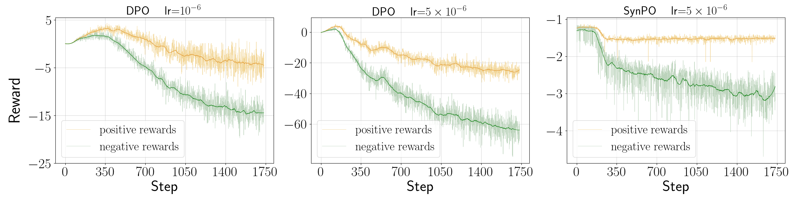
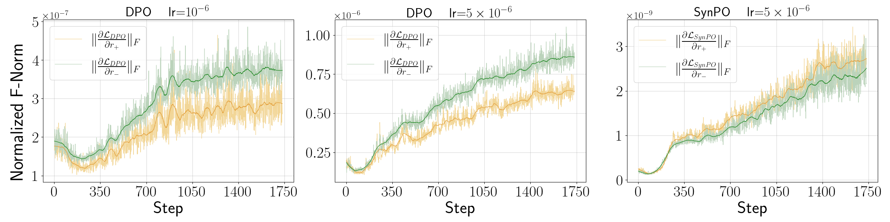

# Synergistic Preference Optimization (SynPO)
This repository contains the code for our paper. We propose a pipeline for constructing preference pairs that leverages the intrinsic properties of VLMs along with partial assistance from LLMs. Besides, we introduce a new preference optimization method, named Synergistic Preference Optimization (SynPO), which offers several advantages over DPO and its variants.  





# Running the data construction pipeline

This contains four steps:  
First, divide each video into short clips.

```bash
python generate_caption1.py --dir_path /your/path/to/video_dir --output_dir /your/path/to/output_dir
```

Second, generate clip-level captions.

```bash
python generate_caption2.py \
  --dir_path /your/path/to/video_dir \
  --pretrained_pth /your/path/to/pretrained_model \
  --image_processor_path /your/path/to/image_processor \
  --dataset_path /your/path/to/dataset \
  --output_file /your/path/to/short_generation.jsonl \
  --batch_size 16
```

Third, generate multiple candidate captions per video the same prompt.

```bash
python generate_caption3.py \
  --dir_path /your/path/to/video_dir \
  --pretrained_pth /your/path/to/pretrained_model \
  --image_processor_path /your/path/to/image_processor \
  --output_file /your/path/to/long_generation.jsonl \
  --batch_size 16
```

Fourth, score the candidate captions via calling LLM API and rank.

```bash
export API_URL='...'
export API_KEY='...'
export API_MODEL='...'
python generate_caption4.py \
  --short_generation_file /your/path/to/short_generation.jsonl \
  --long_generation_file /your/path/to/long_generation.jsonl \
  --output_file /your/path/to/output.jsonl
```

# Running SynPO

Alpha implicitly control the gap between positive rewards and negative rewards. Beta control the trade-off between preference ranking and retainment of both semantics and syntax.

```bash
python train_synpo.py \
  --pretrained_pth /your/path/to/pretrained_model \
  --image_processor_path /your/path/to/image_processor \
  --dataset_path /your/path/to/dataset.jsonl \
  --dir_path /your/path/to/video \
  --log_file /your/path/to/output.log \
  --model_dir /your/path/to/model \
  --batch_size 1 \
  --num_epochs 5 \
  --lr 5e-6 \
  --accumulation_steps 32 \
  --alpha 30 \
  --beta 0.2
```

# Profiling

Running DPO check:

```bash
python train_dpo_check.py \
  --pretrained_pth /your/path/to/pretrained_model \
  --image_processor_path /your/path/to/image_processor \
  --dataset_path /your/path/to/dataset.jsonl \
  --dir_path /your/path/to/video \
  --log_file /your/path/to/output.log \
  --model_dir /your/path/to/model \
  --batch_size 1 \
  --num_epochs 5 \
  --lr 5e-6 \
  --accumulation_steps 32
```

Running SynPO check:

```bash
python train_synpo_check.py \
  --pretrained_pth /your/path/to/pretrained_model \
  --image_processor_path /your/path/to/image_processor \
  --dataset_path /your/path/to/dataset.jsonl \
  --dir_path /your/path/to/video \
  --log_file /your/path/to/output.log \
  --model_dir /your/path/to/model \
  --batch_size 1 \
  --num_epochs 5 \
  --lr 5e-6 \
  --accumulation_steps 32 \
  --alpha 30 \
  --beta 0.2
```

# Citing SynPO

```bibtex
@inproceedings{Jisheng2024synpo,
  title = {SynPO: Synergizing Descriptiveness and Preference
Optimization for Video Detailed Captioning},
  author    = {Jisheng Dang and Yizhou Zhang and Hao Ye and Teng Wang and Siming Chen and Huicheng Zheng and Yulan Guo and Jianhuang Lai and Bin Hu},
  booktitle = {arXiv preprint arXiv},
  year = {2025}
}
```
